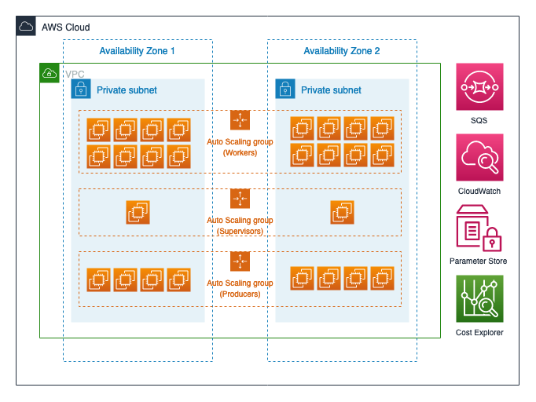
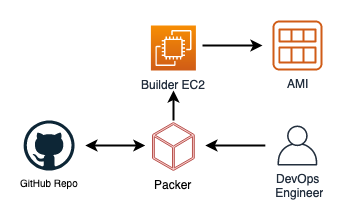
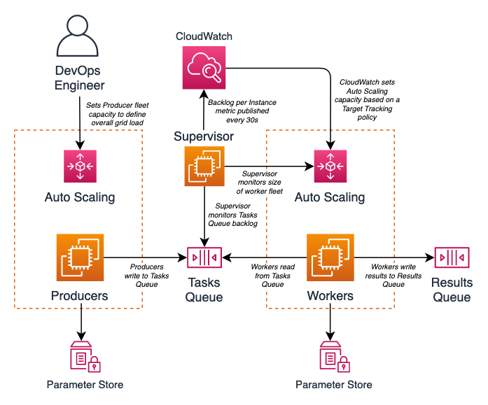

# Running a High-Performance Computing (or HPC) grid on AWS

This code repository offers an example of running a High Performance Computing (HPC) grid workload on AWS, centrally based on Amazon SQS and AWS Auto Scaling services. Amazon SQS is a highly performant and scalable message queuing service, while AWS Auto Scaling can be used to effortlessly manage a fleet of EC2 instances by scaling in or out capacity based on a defined policy. 

The software layer that operates the grid is written in `Python`. To simulate a problem for the grid to solve, the software uses a certain mathematical operation (prime number generation and factorization) that is computationally intensive and whose complexity can be easily controlled by changing certain parameters. The repo also provides Terraform based scripts to create the full deployment infrstructure. It has been tested using Terraform CLI `v0.12.0` along with AWS provider `v2.27.0`. 

## Overview

The grid architecture is very simple, and uses just a handful of AWS services. Figure below shows the AWS deployment architecture:

There are 3 logical components within the software layer, each managed by an AWS Auto Scaling group as shown above: 
- Producers
- Supervisors 
- Workers 

## Design

### 1. Building an AMI

### 2. Running the grid

## License

- **[MIT license](http://opensource.org/licenses/mit-license.php)**
- Copyright 2020 &copy; Sachin Hamirwasia
